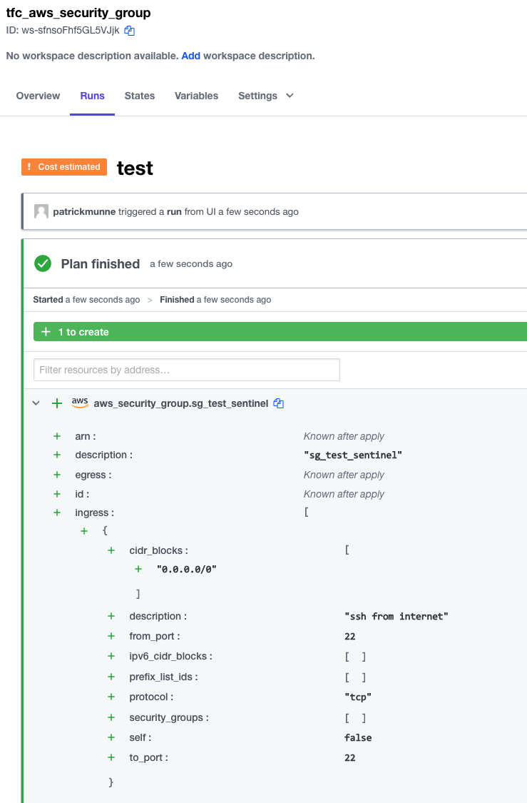
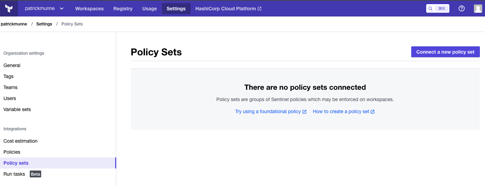
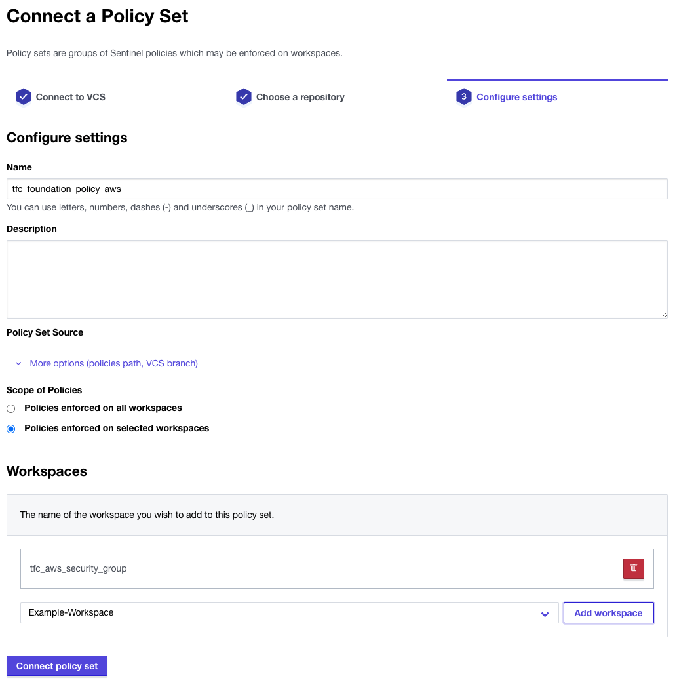

# tfc_aws_security_group

This repository will show you how to use the HashiCorp Foundation Policies Library to force default sentinel policies to make you compliant with the CIS (Center for Internet Security) defaults.

# Prerequisites 

- Make sure you have an account on Terraform Cloud
- Make sure you have AWS credentials

# How to

## Repository tfc_aws_security_group

- Clone/Fork this repository to your own VCS
- Within TFC make a new workspace that points to this repository  
- Run it for the first time. You will see the following output     
  
- The plan show the security group can be created.
- Create the Repository for the Policy set

## Repository for the Policy set

- Clone/Fork the following repository to your own VCS
https://github.com/munnep/tfc_foundation_policy_aws.git
- This contains a single sentinel file that points to the HashiCorp Foundation Policies Library
- Login to your TFC environment
- Go to Settings --> Policy sets --> Connect a new policy set  
  
- Connect to your VCS
- Make sure the policy only applies to the specific workspace you created earlier  
  
- you should now have a policy set connected to your workspace. 

## Repository tfc_aws_security_group

- Run a new plan and you should see an extra chapter Policy Check  
  
- The policy fails because it is hard-mandatory that you don't have ssh open for the public internet